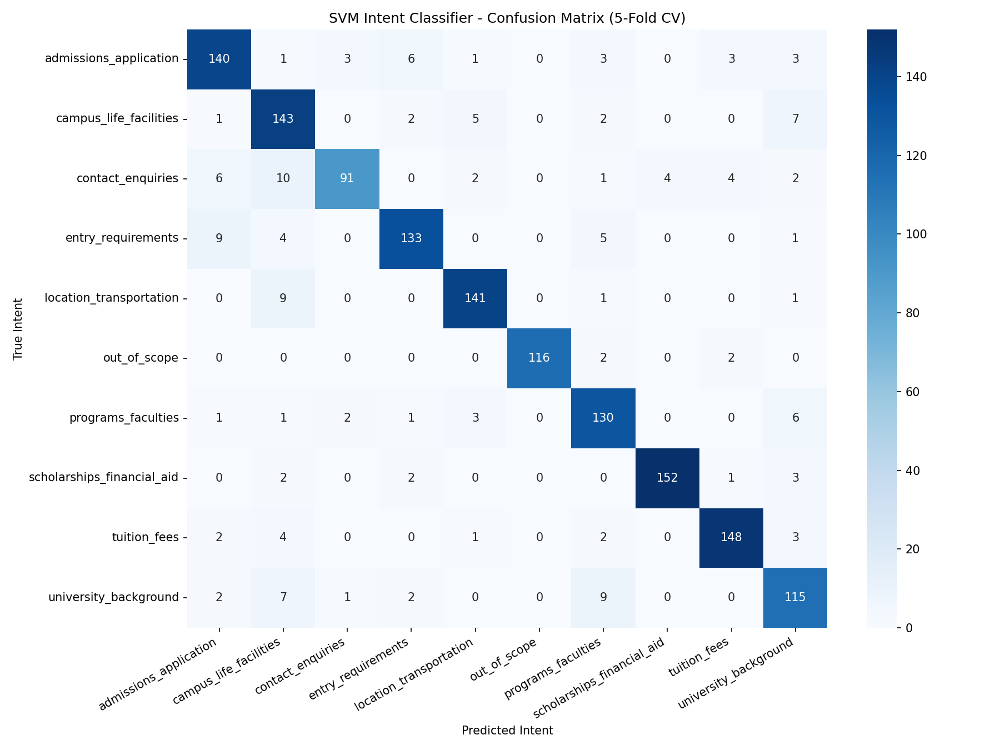

# Ask XMUM — Undergraduate Admissions FAQ Chatbot

> **An intelligent, retrieval-based FAQ chatbot for Xiamen University Malaysia (XMUM), powered by a hybrid NLP pipeline combining TF-IDF vectorisation, Support Vector Machine intent classification, and cosine similarity retrieval.**

---

## Table of Contents

1. [Project Overview](#1-project-overview)
2. [System Architecture](#2-system-architecture)
3. [Repository Structure](#3-repository-structure)
4. [NLP Pipeline — How It Works](#4-nlp-pipeline--how-it-works)
   - 4.1 [Text Preprocessing](#41-text-preprocessing)
   - 4.2 [TF-IDF Vectorisation](#42-tf-idf-vectorisation)
   - 4.3 [SVM Intent Classification](#43-svm-intent-classification)
   - 4.4 [Cosine Similarity Retrieval](#44-cosine-similarity-retrieval)
   - 4.5 [Confidence Thresholding & Fallback](#45-confidence-thresholding--fallback)
5. [Corpus & Data Design](#5-corpus--data-design)
6. [Model Artefacts](#6-model-artefacts)
7. [API Design](#7-api-design)
8. [Frontend Interface](#8-frontend-interface)
9. [Training & Evaluation](#9-training--evaluation)
10. [Dependencies](#10-dependencies)
11. [Local Setup & Running](#11-local-setup--running)
    - 11.1 [Prerequisites](#111-prerequisites)
    - 11.2 [Clone the Repository](#112-clone-the-repository)
    - 11.3 [Create & Activate Environment](#113-create--activate-environment)
    - 11.4 [Install Dependencies](#114-install-dependencies)
    - 11.5 [Download NLTK Data](#115-download-nltk-data)
    - 11.6 [Train the Models](#116-train-the-models)
    - 11.7 [Run the Application](#117-run-the-application)
    - 11.8 [Run the Evaluator (Optional)](#118-run-the-evaluator-optional)
12. [API Reference](#12-api-reference)
13. [Known Issues & Technical Debt](#13-known-issues--technical-debt)
14. [Potential Improvements](#14-potential-improvements)
15. [Acknowledgements](#15-acknowledgements)

---

## 1. Project Overview

**Ask XMUM** is a domain-specific, retrieval-based FAQ chatbot purpose-built for handling undergraduate admissions enquiries for [Xiamen University Malaysia (XMUM)](https://www.xmu.edu.my). It is designed to serve prospective students who have questions about admissions, programs, entry requirements, tuition fees, scholarships, campus life, and more.

Unlike large language model (LLM)-based chatbots, this system is:
- **Fully offline and self-contained** — no third-party AI API calls at inference time.
- **Deterministic and auditable** — responses are always traceable to a specific QA pair in the corpus.
- **Computationally lightweight** — runs comfortably on CPU with minimal RAM.
- **Domain-bounded** — explicitly designed to fall back gracefully when queries are out of scope.

The core NLP pipeline is built from classical machine learning techniques: **TF-IDF** for representation, **SVM** for intent classification, and **cosine similarity** for answer retrieval. The backend is served via a **Flask** REST API, and the frontend is a self-contained single-page HTML/CSS/JS chat interface.

---

## 2. System Architecture

```
┌─────────────────────────────────────────────────────────────────────┐
│                         Browser (User)                              │
│          Single-page Chat UI  (templates/index.html)                │
│                  POST /chat    GET /health                          │
└──────────────────────────┬──────────────────────────────────────────┘
                           │  HTTP / JSON
┌──────────────────────────▼──────────────────────────────────────────┐
│                     Flask REST API  (api/)                          │
│   app.py (Application Factory)  ──►  routes.py (Blueprint)          │
│                                                                     │
│   Endpoints:                                                        │
│     GET  /          → Serves chat UI (render_template)              │
│     POST /chat      → Accepts JSON query, returns JSON answer       │
│     GET  /health    → Returns system health status                  │
└──────────────────────────┬──────────────────────────────────────────┘
                           │  in-process function call
┌──────────────────────────▼──────────────────────────────────────────┐
│                   NLP Inference Pipeline  (nlp/)                    │
│                                                                     │
│  1. preprocessor.py  → lowercase, strip punctuation, tokenise,      │
│                         remove stopwords, synonym expand, lemmatise  │
│                                                                     │
│  2. vectorizer.py    → TF-IDF transform (unigrams + bigrams,        │
│                         max 5000 features, sublinear TF scaling)    │
│                                                                     │
│  3. classifier.py    → SVM (linear kernel, C=1.0) predicts intent  │
│                         + probability score                          │
│                                                                     │
│  4. retriever.py     → Cosine similarity against intent-filtered    │
│                         FAQ vectors, returns best-matching answer   │
│                                                                     │
│  5. pipeline.py      → Orchestrates 1-4; applies confidence gate;   │
│                         returns structured JSON response            │
└──────────────────────────┬──────────────────────────────────────────┘
                           │  pickle.load at startup
┌──────────────────────────▼──────────────────────────────────────────┐
│                      Serialised Model Artefacts  (models/)          │
│                                                                     │
│   tfidf_vectorizer.pkl   ─ Fitted TfidfVectorizer (~155 KB)         │
│   svm_classifier.pkl     ─ Trained SVC with probability (~327 KB)   │
│   faq_vectors.pkl        ─ TF-IDF matrix of all corpus questions     │
│                            (~140 KB, sparse)                        │
│   faq_metadata.pkl       ─ List of dicts: id, intent, question,     │
│                            answer (~205 KB)                         │
└──────────────────────────┬──────────────────────────────────────────┘
                           │  train.py reads
┌──────────────────────────▼──────────────────────────────────────────┐
│                        Corpus  (data/)                              │
│                                                                     │
│   uni_faq_corpus.json    ─ Structured intent→QA corpus (~209 KB)    │
│   corpus_flat.csv        ─ Flattened row-per-question CSV (~927 KB) │
│                            (auto-generated by train.py)             │
└─────────────────────────────────────────────────────────────────────┘
```

**Data flow at inference:**
```
User Query (string)
      │
      ▼
  Preprocessor  →  cleaned text string
      │
      ▼
  Vectorizer.transform  →  sparse TF-IDF vector  (1 × V)
      │
      ├──►  SVM Classifier  →  predicted_intent,  svm_confidence
      │
      └──►  Retriever (filtered by intent)
                  │
                  └──►  cosine_similarity(query_vec, filtered_faq_vecs)
                               │
                               ▼
                         best_score  ≥  CONFIDENCE_THRESHOLD (0.3)?
                                     ├── YES → return matched answer
                                     └── NO  → return fallback message
```

---

## 3. Repository Structure

```
xmum-faq-chatbot/
│
├── run.py                        # Application entry point
├── requirements.txt              # Python package dependencies
├── .gitignore
│
├── api/                          # Flask application package
│   ├── app.py                    # Application factory (create_app)
│   └── routes.py                 # URL routes & blueprint definition
│
├── nlp/                          # NLP inference modules
│   ├── pipeline.py               # Orchestrator: load_pipeline(), get_response()
│   ├── preprocessor.py           # Text cleaning, synonym expansion, lemmatisation
│   ├── vectorizer.py             # TF-IDF vectoriser wrapper
│   ├── classifier.py             # SVM classifier wrapper
│   └── retriever.py              # Cosine similarity FAQ retriever
│
├── training/                     # Offline training & evaluation scripts
│   ├── train.py                  # Fits and serialises all model artefacts
│   ├── evaluate.py               # 5-fold CV evaluation + confusion matrix
│   └── confusion_matrix.png      # Pre-generated evaluation artefact
│
├── data/                         # Corpus data
│   ├── uni_faq_corpus.json       # Master structured FAQ corpus (source of truth)
│   └── corpus_flat.csv           # Flattened CSV (generated by train.py)
│
├── models/                       # Serialised model artefacts (generated by train.py)
│   ├── tfidf_vectorizer.pkl
│   ├── svm_classifier.pkl
│   ├── faq_vectors.pkl
│   └── faq_metadata.pkl
│
└── templates/                    # Flask Jinja2 templates
    └── index.html                # Self-contained chat UI (HTML + CSS + JS)
```

---

## 4. NLP Pipeline — How It Works

### 4.1 Text Preprocessing

**File:** [`nlp/preprocessor.py`](nlp/preprocessor.py)

Every user query is passed through a deterministic preprocessing pipeline before any ML model sees it:

| Step | Operation | Example |
|------|-----------|---------|
| 1 | Lowercase | `"What are the Fees?"` → `"what are the fees?"` |
| 2 | Punctuation removal | `"fees?"` → `"fees"` |
| 3 | NLTK word tokenisation | `"what are the fees"` → `["what", "are", "the", "fees"]` |
| 4 | Stopword removal | `["what", "are", "the", "fees"]` → `["fees"]` |
| 5 | Synonym expansion | `["fees"]` → `["tuition"]` |
| 6 | WordNet lemmatisation | `["tuition"]` → `["tuition"]` |

**Synonym Dictionary** (13 mappings, defined in `preprocessor.py`):

| Raw Token | Expanded To |
|-----------|-------------|
| `fees`, `fee`, `cost`, `price` | `tuition` |
| `medical`, `health` | `clinic` |
| `contact` | `email phone` |
| `number` | `phone` |
| `apply`, `application` | `admission` |
| `dorm`, `hostel`, `room` | `accommodation` |
| `office`, `dept` | `department` |
| `alumni` | `graduate` |

The synonym expansion is applied **before** lemmatisation, which means common colloquial synonyms are normalised to canonical corpus vocabulary, improving recall for informal queries.

### 4.2 TF-IDF Vectorisation

**File:** [`nlp/vectorizer.py`](nlp/vectorizer.py)

The text representation uses `sklearn.feature_extraction.text.TfidfVectorizer` with the following configuration:

```python
TfidfVectorizer(
    ngram_range=(1, 2),    # Unigrams and bigrams
    max_features=5000,     # Vocabulary capped at top 5000 features by term frequency
    sublinear_tf=True      # Apply log(1 + tf) scaling to reduce dominance of high-frequency terms
)
```

- **Bigrams** capture meaningful two-word phrases (e.g., `"tuition fee"`, `"entry requirement"`).
- **Sublinear TF scaling** prevents common terms from dominating the vector space.
- At inference time, only `vectorizer.transform()` is called (not `fit_transform`), ensuring the vocabulary remains fixed to what was learned during training.

### 4.3 SVM Intent Classification

**File:** [`nlp/classifier.py`](nlp/classifier.py)

A Support Vector Machine with a **linear kernel** classifies the preprocessed query into one of 10 intents:

| Intent Label | Description |
|---|---|
| `admissions_application` | How to apply, application portal, deadlines |
| `programs_faculties` | Available degrees, faculties, course lists |
| `entry_requirements` | Academic requirements, SPM/STPM scores |
| `tuition_fees` | Tuition costs, payment schedules |
| `scholarships_financial_aid` | Scholarships, bursaries, financial aid |
| `campus_life_facilities` | Hostel, clubs, canteen, sports, health |
| `location_transportation` | Campus address, transport, how to get there |
| `university_background` | History, rankings, about XMUM |
| `contact_enquiries` | Phone numbers, emails, office hours |
| `out_of_scope` | Questions unrelated to XMUM admissions |

**Configuration:** `SVC(kernel="linear", C=1.0, probability=True)`

- `probability=True` enables Platt scaling to produce calibrated class probability estimates.
- The linear kernel is preferred over RBF because TF-IDF vectors are high-dimensional and sparse, where linear SVMs are well-proven to perform competitively with lower computational cost.

### 4.4 Cosine Similarity Retrieval

**File:** [`nlp/retriever.py`](nlp/retriever.py)

After intent prediction, the retriever performs a **two-stage** nearest-neighbour search:

1. **Intent filtering:** Only FAQ vectors whose `intent` matches the predicted intent are considered. This dramatically reduces the search space and prevents cross-intent confusion.
2. **Cosine similarity:** The query TF-IDF vector is compared against all filtered FAQ vectors. The FAQ entry with the highest cosine score is returned as the matched answer.

```python
scores = cosine_similarity(query_vector, filtered_vectors)[0]
best_index = np.argmax(scores)
```

The returned object includes: `answer`, `similarity_score`, `matched_question`, `id`, and `intent`.

### 4.5 Confidence Thresholding & Fallback

**File:** [`nlp/pipeline.py`](nlp/pipeline.py)

The pipeline applies a hard confidence gate:

```python
CONFIDENCE_THRESHOLD = 0.3
```

If the cosine similarity score of the best match is below `0.3`, **or** the SVM predicts `out_of_scope`, the system returns a fixed fallback message:

> *"Sorry, I could not find a relevant answer to your question. Please contact the XMUM Admissions Office at admissions@xmu.edu.my for further information."*

The threshold of `0.3` was empirically determined using the evaluation script's threshold sweep (see [Section 9](#9-training--evaluation)).

---

## 5. Corpus & Data Design

**File:** [`data/uni_faq_corpus.json`](data/uni_faq_corpus.json)

The master corpus follows a structured JSON schema:

```json
{
  "corpus": [
    {
      "intent": "admissions_application",
      "qa_pairs": [
        {
          "id": "adm_001",
          "questions": [
            "How do I apply to XMUM?",
            "What is the application process for XMUM?",
            ...
          ],
          "answer": "You can apply to XMUM through..."
        }
      ]
    }
  ]
}
```

**Corpus Statistics:**

| Intent | QA Pairs | Question Variants | 
|--------|----------|-------------------|
| `admissions_application` | 20 | 160 |
| `programs_faculties` | 18 | 144 |
| `entry_requirements` | 19 | 152 |
| `tuition_fees` | 20 | 160 |
| `scholarships_financial_aid` | 20 | 160 |
| `campus_life_facilities` | 20 | 160 |
| `location_transportation` | 19 | 152 |
| `university_background` | 17 | 136 |
| `contact_enquiries` | 15 | 120 |
| `out_of_scope` | 15 | 120 |
| **Total** | **183** | **1,464** |

Each QA pair has **~8 question paraphrases** on average. The training data is flattened row-by-row during training, meaning the SVM trains on 1,464 individual question samples. Each row maps to a `(question_text, intent_label)` pair.

**Generated artefact:** `data/corpus_flat.csv` is auto-generated by `training/train.py` and stores all flattened rows with columns: `id`, `intent`, `question`, `answer`.

---

## 6. Model Artefacts

All serialised artefacts are stored in `models/` and are produced by `training/train.py`. They are loaded at application startup via `nlp/pipeline.py:load_pipeline()`.

| File | Contents | Size |
|------|----------|------|
| `tfidf_vectorizer.pkl` | Fitted `TfidfVectorizer` (vocabulary + IDF weights) | ~155 KB |
| `svm_classifier.pkl` | Trained `SVC` with Platt-scaled probabilities | ~327 KB |
| `faq_vectors.pkl` | Sparse TF-IDF matrix for all 1,464 corpus questions | ~140 KB |
| `faq_metadata.pkl` | List of 1,464 dicts `{id, intent, question, answer}` | ~205 KB |

> **Note:** These artefacts are committed to the repository so the server can start without re-training. If the corpus is updated, re-running `training/train.py` regenerates all four files.

---

## 7. API Design

**Backend:** Flask 2.3+ with `flask-cors` for cross-origin support.

**Application Factory Pattern:** `api/app.py` uses `create_app()` to instantiate the Flask app, attach CORS, load the NLP pipeline, and register the `chat_bp` blueprint. This pattern allows for easy testability by instantiating separate app instances per test.

### Endpoints

| Method | Path | Description |
|--------|------|-------------|
| `GET` | `/` | Serves the chat UI (`templates/index.html`) |
| `POST` | `/chat` | Accepts a JSON body, returns a JSON answer |
| `GET` | `/health` | Returns system health and model load status |

### `POST /chat` — Request

```json
{
  "message": "How do I apply to XMUM?"
}
```

### `POST /chat` — Response (success)

```json
{
  "answer": "You can apply to XMUM through the online portal at...",
  "intent": "admissions_application",
  "confidence": 0.7423,
  "matched_question": "How do I apply to XMUM?",
  "id": "adm_001"
}
```

### `POST /chat` — Response (fallback)

```json
{
  "answer": "Sorry, I could not find a relevant answer...",
  "intent": "out_of_scope",
  "confidence": 0.1821,
  "matched_question": null,
  "id": null
}
```

### `GET /health` — Response

```json
{
  "status": "ok",
  "models_loaded": true
}
```

### Error Responses

| Status Code | Condition |
|-------------|-----------|
| `400` | Missing or empty `message` field in request body |
| `500` | Internal server error (e.g., model not loaded) |

---

## 8. Frontend Interface

**File:** [`templates/index.html`](templates/index.html)

The UI is a **zero-dependency, self-contained** single-page application (~897 lines) served directly by Flask via `render_template`. It uses no JavaScript frameworks — all interactivity is vanilla JS.

**Design System:**
- Dark glassmorphism theme with ambient gradient glows
- CSS custom properties (`--accent-blue`, `--glass-bg`, etc.) for design token consistency
- Google Fonts: `Inter` (body) + `Outfit` (headings)
- FontAwesome 6.4 (CDN) for icons

**Key UI Features:**

| Feature | Implementation |
|---------|----------------|
| Split layout (sidebar + chat) | CSS Flexbox |
| Responsive design | Media query hides sidebar at `≤768px`; mobile pills appear |
| Typing indicator | 3-dot CSS animation (`typing-bounce` keyframes) |
| Message slide-in animation | `message-slide-up` CSS keyframe |
| Bot metadata display | Intent pill + confidence pill rendered below bot bubbles |
| Health check button | `GET /health` via `fetch()` |
| Conversation clear | Removes all messages except welcome |
| Input clear button | Appears dynamically on input |
| Suggestion shortcuts | Sidebar (desktop) + horizontal-scroll pills (mobile) |

**JavaScript API Communication:**

```javascript
const response = await fetch('/chat', {
  method: 'POST',
  headers: { 'Content-Type': 'application/json' },
  body: JSON.stringify({ message: text })
});
```

> **Note:** The frontend currently does **not** render the `intent` and `confidence` fields from the API response despite receiving them (the `appendMessage` metadata argument is accepted but not displayed in the UI). This is a known issue — see [Section 13](#13-known-issues--technical-debt).

---

## 9. Training & Evaluation

### Training

**File:** [`training/train.py`](training/train.py)

Run this script to (re-)train all models from the corpus:

```bash
python training/train.py
```

**Steps performed:**
1. Loads and flattens `data/uni_faq_corpus.json` into 1,464 rows.
2. Exports `data/corpus_flat.csv`.
3. Preprocesses all questions using `nlp/preprocessor.py`.
4. Fits and saves `TfidfVectorizer` → `models/tfidf_vectorizer.pkl`.
5. Trains and saves `SVC` → `models/svm_classifier.pkl`.
6. Saves the full TF-IDF matrix → `models/faq_vectors.pkl`.
7. Saves FAQ metadata list → `models/faq_metadata.pkl`.
8. Prints a per-intent question count summary.

### Evaluation

**File:** [`training/evaluate.py`](training/evaluate.py)

Run this script to measure model performance:

```bash
python training/evaluate.py
```

**Evaluation methodology:**
- **5-fold stratified cross-validation** on all 1,464 questions.
- Reports per-fold accuracy, mean CV accuracy, and standard deviation.
- Generates a full `sklearn` classification report (precision, recall, F1 per intent).
- Produces and saves a confusion matrix heatmap: `training/confusion_matrix.png`.
- Runs a **threshold sweep** over `[0.3, 0.4, 0.5, 0.6]` to show the trade-off between fallback rate and answer rate, informing the `CONFIDENCE_THRESHOLD` choice in `pipeline.py`.

**Pre-generated confusion matrix:**



---

## 10. Dependencies

| Package | Version Constraint | Purpose |
|---------|--------------------|---------|
| `flask` | `>=2.3.0` | Web framework (REST API + template serving) |
| `flask-cors` | `>=4.0.0` | Cross-Origin Resource Sharing (CORS) headers |
| `nltk` | `>=3.8.1` | Tokenisation, stopword removal, WordNet lemmatisation |
| `scikit-learn` | `>=1.3.0` | TF-IDF vectoriser, SVM classifier, cosine similarity, cross-validation |
| `numpy` | `>=1.24.0` | Array operations for similarity scoring |
| `pandas` | `>=2.0.0` | (Used implicitly by training data inspection; CSV export uses stdlib `csv`) |
| `matplotlib` | `>=3.7.0` | Confusion matrix visualisation |
| `seaborn` | `>=0.12.0` | Heatmap styling for confusion matrix |

**NLTK Data Packages required at runtime:**
- `punkt` / `punkt_tab` — word tokenisation
- `stopwords` — English stopword list
- `wordnet` — WordNet lemmatiser lexicon

---

## 11. Local Setup & Running

### 11.1 Prerequisites

- **Python 3.9+** (3.10 or 3.11 recommended)
- **Conda** (recommended, as indicated by `.vscode/settings.json`) or `pip` + `venv`
- Git

### 11.2 Clone the Repository

```bash
git clone https://github.com/<your-username>/xmum-faq-chatbot.git
cd xmum-faq-chatbot
```

### 11.3 Create & Activate Environment

**Using Conda (recommended):**
```bash
conda create -n xmum-chatbot python=3.11 -y
conda activate xmum-chatbot
```

**Using venv:**
```bash
python -m venv .venv
# Windows
.venv\Scripts\activate
# macOS / Linux
source .venv/bin/activate
```

### 11.4 Install Dependencies

```bash
pip install -r requirements.txt
```

### 11.5 Download NLTK Data

Run the following **once** in a Python shell or script:

```python
import nltk
nltk.download('punkt')
nltk.download('punkt_tab')
nltk.download('stopwords')
nltk.download('wordnet')
```

Or from the command line:

```bash
python -c "import nltk; nltk.download('punkt'); nltk.download('punkt_tab'); nltk.download('stopwords'); nltk.download('wordnet')"
```

### 11.6 Train the Models

> **Skip this step** if the `models/` directory already contains the four `.pkl` files (they are committed to the repository).

```bash
python training/train.py
```

Expected output:
```
Loading corpus...
Loaded 1464 question rows across 10 intents.
Flat CSV exported to data/corpus_flat.csv
Preprocessing questions...
Fitting TF-IDF and transforming corpus...
TF-IDF vectorizer saved. Matrix shape: (1464, 5000)
Training SVM classifier...
SVM classifier saved.
Saving FAQ vectors and metadata...
FAQ vectors and metadata saved.

Training complete.
Total: 1464 questions across 10 intents
  admissions_application: 160
  ...
```

### 11.7 Run the Application

```bash
python run.py
```

The Flask development server starts on **http://127.0.0.1:5000**. Open this URL in your browser to use the chatbot.

```
 * Running on http://127.0.0.1:5000
 * Debug mode: on
```

> **Note:** The application runs in `debug=True` mode. This enables the auto-reloader and interactive debugger. **Do not use debug mode in production.**

### 11.8 Run the Evaluator (Optional)

```bash
python training/evaluate.py
```

This will print cross-validation metrics to the console and overwrite `training/confusion_matrix.png`.

---

## 12. API Reference

### Quick Test with `curl`

**Send a chat message:**
```bash
curl -X POST http://127.0.0.1:5000/chat \
  -H "Content-Type: application/json" \
  -d "{\"message\": \"What scholarships are available at XMUM?\"}"
```

**Health check:**
```bash
curl http://127.0.0.1:5000/health
```

### Quick Test with Python `requests`

```python
import requests

resp = requests.post(
    "http://127.0.0.1:5000/chat",
    json={"message": "What is the tuition fee for Computer Science?"}
)
print(resp.json())
```

---

## 13. Known Issues & Technical Debt

The following issues were identified through static code analysis of this repository:

### 🔴 Critical

| # | Issue | Location | Impact |
|---|-------|----------|--------|
| 1 | **Hardcoded relative paths in NLP modules** | `nlp/classifier.py` L4, `nlp/vectorizer.py` L4, `nlp/retriever.py` L5–6 | Default path constants (`"models/svm_classifier.pkl"`) are relative to the CWD, not the script's directory. This works only if the process is started from the project root. Calling from another CWD will raise `FileNotFoundError`. |
| 2 | **No NLTK data download check** | `nlp/preprocessor.py` L3–5 | If `punkt`, `stopwords`, or `wordnet` are not downloaded, the import silently succeeds but `word_tokenize()` raises `LookupError` at runtime, crashing the server with a 500 error and no useful user-facing message. |
| 3 | **Evaluate script uses relative paths** | `training/evaluate.py` L16–17 | `CORPUS_PATH = "data/uni_faq_corpus.json"` and `REPORTS_DIR = "training"` are relative; the script must be run from the project root. Running with `python training/evaluate.py` from the `training/` directory will fail. |

### 🟡 Semantic / Logic Issues

| # | Issue | Location | Impact |
|---|-------|----------|--------|
| 4 | **SVM confidence score is unused in gating** | `nlp/pipeline.py` L41, L47 | The SVM's `svm_confidence` is captured but the threshold gate only checks `similarity_score` (cosine). This means a high-SVM-confidence / low-cosine prediction still falls back. Conversely, a low-SVM-confidence / high-cosine match may be returned. A combined scoring strategy would be more robust. |
| 5 | **`out_of_scope` intent can still retrieve an answer** | `nlp/retriever.py` L27–34, `nlp/pipeline.py` L47 | The `retrieve()` function will attempt to match against `out_of_scope` corpus entries. If the predicted intent is `out_of_scope` but cosine score is ≥ 0.3, the pipeline.py condition `predicted_intent != "out_of_scope"` correctly blocks it — but `retriever.retrieve()` has already performed unnecessary work. |
| 6 | **`appendMessage` metadata parameter is silently ignored** | `templates/index.html` L800–803 | The API returns `intent` and `confidence` per response. The `appendMessage()` function accepts a `metadata` argument and constructs intent/confidence pills in the UI spec, but the conditional block building the pill HTML is missing — metadata is never displayed. |
| 7 | **Typo in frontend suggestion text** | `templates/index.html` L644 | `"How much is the tuition fee in XMUM??"` has a double question mark. Minor, but visible to users. |
| 8 | **`pandas` listed as dependency but not used in core code** | `requirements.txt` L6 | `pandas` is imported nowhere in `api/`, `nlp/`, or `training/`. The `corpus_flat.csv` is written using Python's built-in `csv` module. This adds ~40 MB of unnecessary installation overhead. |
| 9 | **No `__init__.py` in `nlp/` or `api/` packages** | `nlp/`, `api/` | Both directories lack `__init__.py` files. Python package resolution works due to `sys.path.insert(0, ROOT_DIR)` hacks spread across multiple files. This is fragile and non-standard; explicit package files should be used. |
| 10 | **Global mutable state via module-level singletons** | `nlp/classifier.py`, `nlp/vectorizer.py`, `nlp/retriever.py` | Models are stored as module-level globals (`_model`, `_vectorizer`, `_faq_vectors`). This is not thread-safe. Under Flask's multi-threaded WSGI deployment (e.g., with Gunicorn), concurrent writes during initialisation could cause race conditions. |

### 🟢 Minor / Cosmetic

| # | Issue | Location | Impact |
|---|-------|----------|--------|
| 11 | **`btn-theme-toggle` ID mismatch** | `templates/index.html` L621 | The health check button has `id="btn-theme-toggle"` but its function is `checkAppHealth()`. The ID implies a theme toggle that does not exist. |
| 12 | **`static` folder referenced but not created** | `api/app.py` L18–19 | The Flask app declares `static_folder=".../static"`, but the `static/` directory is in `.gitignore` and does not exist. This causes a non-fatal warning but will silently fail if static assets are ever expected. |
| 13 | **No rate limiting** | `api/routes.py` | The `/chat` endpoint has no throttling. Repeated rapid requests could lead to CPU spikes given the synchronous SVM inference. |

---

## 14. Potential Improvements

The following improvements would meaningfully advance the project while preserving its core concept of a deterministic, retrieval-based, lightweight FAQ chatbot:

### NLP & Model Quality

- **Sentence Transformers / SBERT embeddings** — Replace TF-IDF with semantic embeddings (e.g., `all-MiniLM-L6-v2` from `sentence-transformers`). These models capture semantic similarity ("cost of studying" ≈ "tuition fees") without relying on lexical overlap or handwritten synonym lists, dramatically improving retrieval recall.
- **BM25 retrieval** — Augment or replace cosine similarity with BM25 (e.g., via `rank-bm25`) for a term-frequency-aware retrieval baseline that handles sparse queries better.
- **Hybrid confidence scoring** — Combine SVM probability and cosine similarity into a weighted final confidence score, rather than using only cosine for the threshold gate.
- **Expand synonym dictionary** — The current 13-entry synonym map misses many common university-specific synonyms (e.g., `"scholarship"` → `"bursary"`, `"course"` → `"programme"`, `"uni"` → `"university"`).
- **Data augmentation** — Use back-translation or paraphrase models (e.g., `pegasus-paraphrase`) to increase question variant diversity per QA pair.

### Software Engineering

- **Add `__init__.py`** to `nlp/` and `api/` and remove `sys.path.insert` hacks across all files.
- **Centralise path resolution** into a single `config.py` or use `importlib.resources` to resolve paths relative to the package root.
- **Add `pytest` test suite** — Currently `tests/` is in `.gitignore` and absent. Unit tests for each NLP module and integration tests for API endpoints are essential.
- **Lazy NLTK download** — Add a startup check (`try/except LookupError`) that downloads missing NLTK corpora automatically on first run.
- **Thread-safe model loading** — Replace module-level globals with a thread-local or application-context pattern (e.g., Flask's `g` object or a class-based pipeline).
- **Pin all dependency versions** — `requirements.txt` uses `>=` ranges. Add a `requirements-lock.txt` (via `pip freeze`) for reproducible builds.

### Production Readiness

- **WSGI server** — Replace the Flask development server with Gunicorn: `gunicorn -w 4 "api.app:create_app()"`.
- **Dockerise the application** — Add a `Dockerfile` and `docker-compose.yml` for portable deployment.
- **Environment configuration** — Move `debug`, `port`, and threshold parameters to environment variables or a `.env` file (e.g., using `python-dotenv`).
- **Rate limiting** — Add `flask-limiter` to prevent abuse of the `/chat` endpoint.
- **Logging** — Replace `print()` in training scripts with Python's `logging` module; add structured request logging in the Flask app.
- **CORS restriction** — `CORS(app)` with no arguments allows all origins. Restrict to the deployment domain in production.

### UX / Frontend

- **Display intent and confidence pills** — The API returns this data; the UI already has the CSS classes for it — the JS logic to render them just needs to be completed (see Issue #6 above).
- **Markdown rendering** — Bot answers sometimes contain bullet-point lists as plain text. A lightweight Markdown renderer (e.g., `marked.js`) would improve readability.
- **Conversation history context** — Currently, each query is stateless. Storing a short conversation history client-side and appending it as context (e.g., "last asked about fees") could improve relevance for follow-up questions.
- **Session persistence** — Use `localStorage` to persist the conversation across page refreshes.

---

## 15. Acknowledgements

- **Corpus data** curated specifically for XMUM undergraduate admissions queries.
- NLP pipeline built with [scikit-learn](https://scikit-learn.org/), [NLTK](https://www.nltk.org/), and [NumPy](https://numpy.org/).
- Web backend powered by [Flask](https://flask.palletsprojects.com/).
- Chat UI design uses [Inter](https://fonts.google.com/specimen/Inter) and [Outfit](https://fonts.google.com/specimen/Outfit) from Google Fonts, and [FontAwesome](https://fontawesome.com/) icons.

---

*For enquiries about XMUM undergraduate admissions, visit [www.xmu.edu.my](https://www.xmu.edu.my) or email [admissions@xmu.edu.my](mailto:admissions@xmu.edu.my).*
